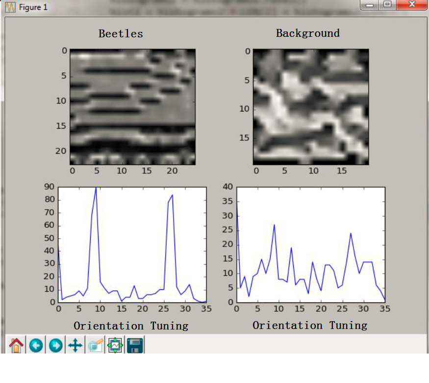

# **Beetles-Tracker**

## **Summary of the project:**

This is the Project for AI coding challenge, written in Python and OpenCV.
It can integrates several algorithms to identify beetles in the image datasets. 
Two kinds of unsupervised machine learning methods (KMean and LDA) were used to perform clustering analysis
on the email dataset. All the emails are preprocessed (strip header, attachment, and quote) before clustering
analysis are performed. Each email is assigned to a cluster/topic. We can use the generated topic keywords to
summarize the content of communication embeded in the same cluster of emails
We also extract the sender and receiver information from each email. Thus for each user account, we can summarize
who is the given account communicating with and what are the prevalent email topics for the given account

## **Requirement**

This program requires Python 2.7 and OpenCV 3.0

## **Features**
* calculate the color histogram for the sample beetles
* Use the sliding window method to calculate the correlation coefficient of color histogram between each
test image patch and sample beetles
* clustering analysis (KMean and LDA) based on the whole dataset (>100,000 emails), get a bunch of topics
* calculate the correlation map for each test image and highlight the identified beetles

