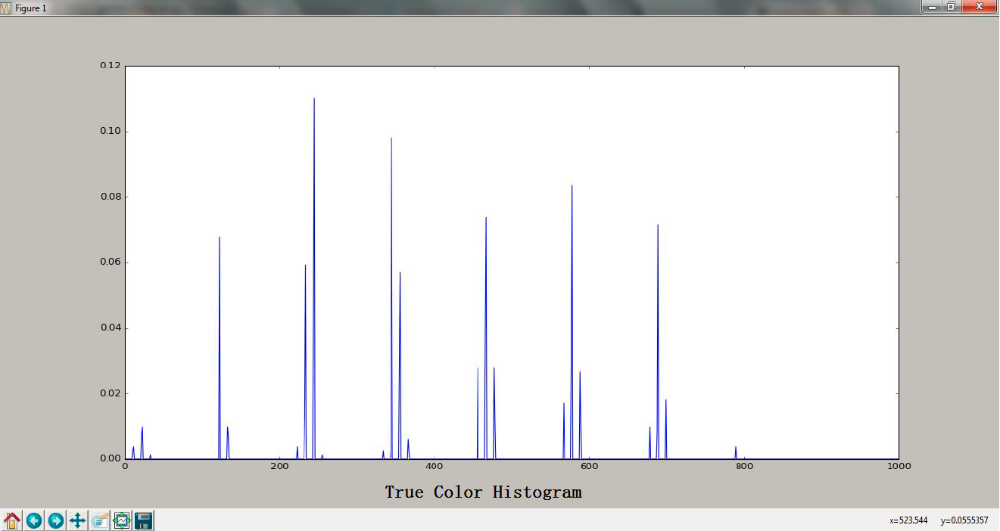
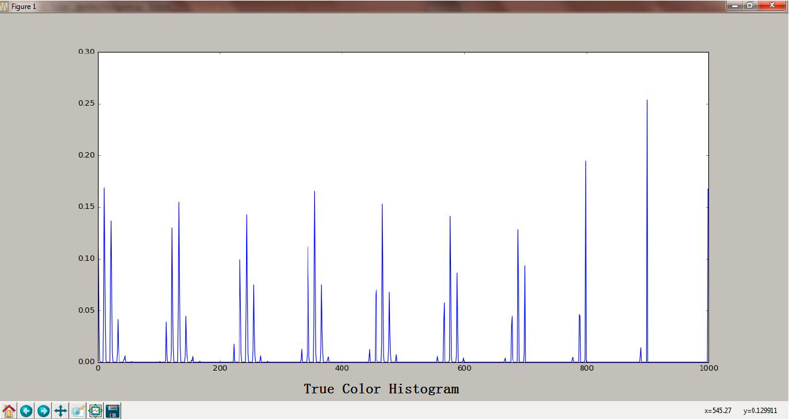
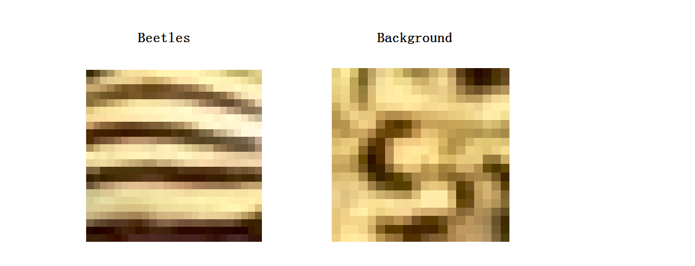

# **Beetles-Tracker**

## **Summary of the project:**

This is the Project for AI coding challenge, written in Python and OpenCV.
It can integrates several algorithms to identify beetles in the image datasets. 
A sliding window method is used to calculate the correlation value for each 20 x 20 image patch in the test image.
The first algorithm is using the color histogram of sample beetles as template and calculating the correlation 
coefficient of color histogram between sample beetles and test image patch. 
The second algorithm is calculating the circular variance of orientation tuning curve for each image patch. The
higher the circular variance is, the more likely it's corresponding to a beetle.
The correlation value for each image patch is calculated as the multiplication of correlation coefficient and 
circular variance.
The correlation map is thresholded to identify possible beetles.

## **Requirement**

This program requires Python 2.7 and OpenCV 3.0

## **Features**
* calculate the color histogram for the sample beetles
* use the sliding window method to calculate the correlation coefficient of color histogram between each
test image patch and sample beetles
* calculate the circular variance (CV) for each test image patch, the higher CV is the more likely it's a beetle 
* calculate the correlation map as the multiplication of correlation coefficient and circular variance
* calculate the correlation map for each test image and highlight the identified beetles

## **Color Histogram**

#### **color histogram of sample beetles**

Five beetles are used as sample to calculate the true color histogram. The template is used to calculate the 
correlation coefficient for each test image patch.

#### **color histogram of background**

An example of color histogram for background is plotted to facilitate comparison with the template color histogram.
The color histogram for background is different from that of template.

## **Circular Variance**

#### **beetles have striped pattern**

To facilitate comparison, two image patches are drawn. Image on the left corresponds to beetle. We can see clear 
striped pattern. Image on the right is background. We can see that although they share similar color histogram, 
their patterns are very different from each other.

